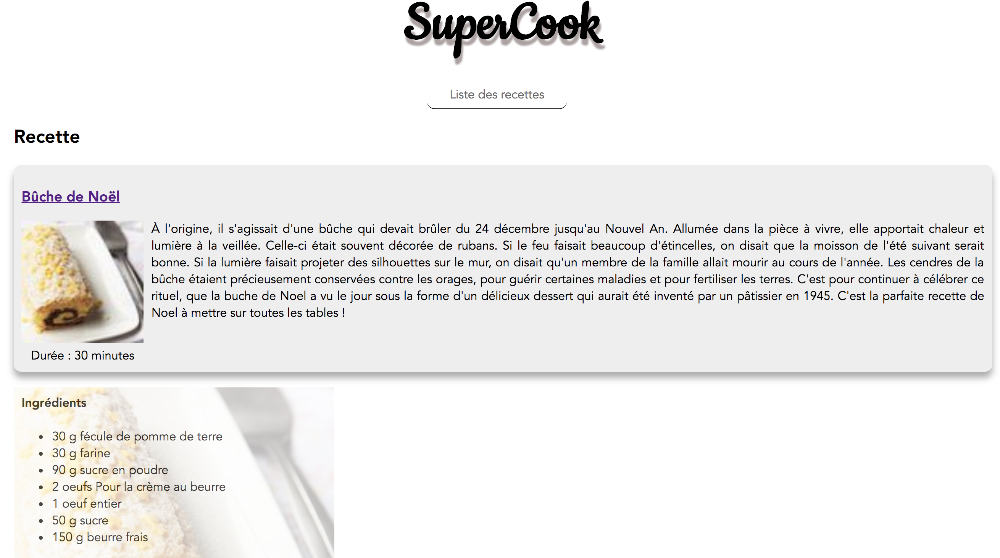

# Hands-On Vue.js

> [Accès à la présentation](https://raw.githubusercontent.com/xebia-france/devoxx2018-vuejs/master/presentation-vuejs.pdf)

- Ludovic Ladeu
- Thomas Champion [@ReeskaFr](https://twitter.com/ReeskaFr)

## Installation

### Prérequis

Attention, pour fonctionner Vue.js requière au moins **node v5**.

``` bash
# install dependencies
npm install

# serve with hot reload at localhost:8080
npm run serve
```

Plus d'informations sur la très complète [documentation officielle](https://vuejs.org/v2/guide/).

## Synopsis

L'objectif de ce Hand's On est de mettre en pratique vos connaissances sur Vue.js en développant une application de partage de recettes.

Cet exercice est découpé en 5 étapes afin d'introduire au fur et à mesure les concepts de Vue.js, et ainsi de construire l'application qui détrônera Marmiton.

## Etape 3

Cette étape consiste à afficher une vue détaillée de la recette en incluant notamment la liste des ingrédients.

Pour ce faire nous allons devoir créer un nouveau composant et mettre en place le routage.

### 0. Prérequis

Installer Vue Router avec la commande suivante :

```bash
npm install vue-router --save
```

### 1. Création du composant de détail

Créer un fichier `RecipeDetail.vue` dans le répertoire *components*

Pour la partie script :
* Importer le service `recipes-service`
* Importer le composant `Recipe`
* Ce composant doit prendre en entrée l'uid de la recette
* Récupérer la recette grâce à l'uid 

Pour la partie template :
* Afficher la recette en utilisant le composant `Recipe`
* Afficher la liste des ingrédients en utilisant `v-for`

Vous pouvez vous servir du style suivant pour s'approcher du résultat attendu :

```html
<style scoped lang="scss">
  .details {
    position: relative;

    .img-big {
      text-align: center;
      position: absolute;
      z-index: 1;
      opacity: 0.3;
    }

    .ingredients {
      padding: 10px;

      h4 {
        margin-top: 0;
      }
    }
  }
</style>
```

### 2. Mise en place du routage

* Compléter les TODOs du fichier `src/router/index.js`
  * La route vers la liste des recettes doit répondre sur `/` et sur `/recipes` (voir [la documentation de Vue router](https://router.vuejs.org/en/essentials/redirect-and-alias.html))
* Brancher le router sur l'instance de Vue déclarée dans le fichier `src/main.js`
* Compléter les TODOs du fichier `src/App.vue` (définition du routage dans le template)

#### Résultat attendu



A vous de jouer !

Si vous avez terminé, ou pour les plus impatients, vous trouverez la suite et solution sur la [branche step-4](https://github.com/xebia-france/devoxx2018-vuejs/tree/step-4).
