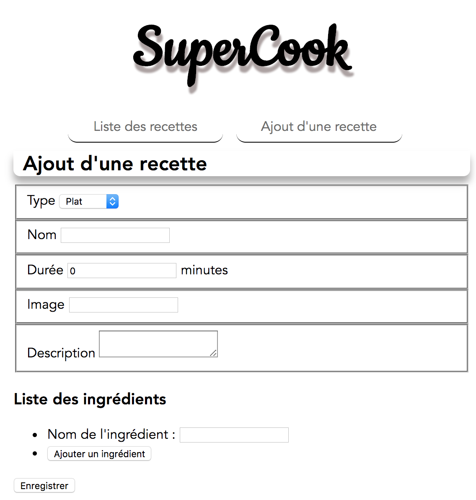

# Hands-On Vue.js

> [Accès à la présentation](https://raw.githubusercontent.com/xebia-france/devoxx2018-vuejs/master/presentation-vuejs.pdf)

- Ludovic Ladeu
- Thomas Champion [@ReeskaFr](https://twitter.com/ReeskaFr)

## Installation

### Prérequis

Attention, pour fonctionner Vue.js requière au moins **node v6**.

``` bash
# install dependencies
npm install

# serve with hot reload at localhost:8080
npm run serve
```

Plus d'informations sur la très complète [documentation officielle](https://vuejs.org/v2/guide/).

## Synopsis

L'objectif de ce Hand's On est de mettre en pratique vos connaissances sur Vue.js en développant une application de partage de recettes.

Cet exercice est découpé en 5 étapes afin d'introduire au fur et à mesure les concepts de Vue.js, et ainsi de construire l'application qui détrônera Marmiton.

## Etape 4

Cette étape consiste à développer la fonctionnalité qui permettra aux utilisateurs d'ajouter leur propres recettes.

Pour ce faire il va falloir créer un nouveau composant `AddRecipe` qui sera accessible via le chemin `/add-recipes`.

### 1. Création du composant `AddRecipe`

Créer un fichier AddRecipe.vue dans le répertoire components

Pour la partie **script** :

* Importer le service recipes-service
* Pour ajouter une nouvelle recette vous devez utiliser la méthode `addRecipe`

Pour la partie **template** :

* Créer un formulaire qui contient les champs suivants :
  * type : ce champ peut être une liste comprenant les valeurs possibles :
    * Plat
    * Dessert
    * Entrée
    * Boisson
  * nom
  * histoire
  * img_small
  * une liste d'ingredients
  * ainsi qu'un bouton **Sauvegarder**

### 2. Routage

Maintenant que votre composant est disponible ajouter une entrée dans la liste routes dans le fichier `src/router/index.js`.

#### Résultat attendu



A vous de jouer !

Si vous avez terminé, ou pour les plus impatients, vous trouverez la suite et solution sur la [branche step-5](https://github.com/xebia-france/devoxx2018-vuejs/tree/step-5).
