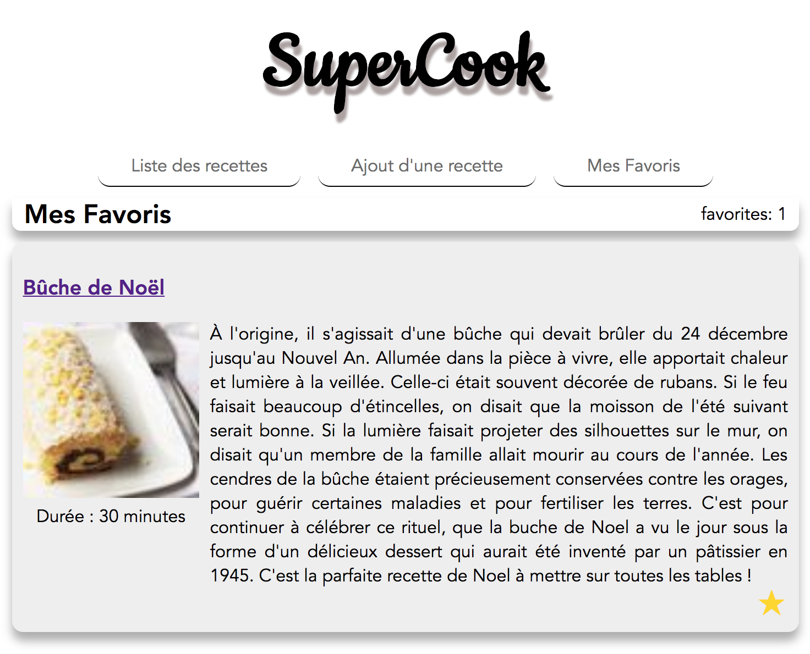

# Hands-On Vue.js

> [Accès à la présentation](https://raw.githubusercontent.com/xebia-france/devoxx2018-vuejs/master/presentation-vuejs.pdf)

- Ludovic Ladeu
- Thomas Champion [@ReeskaFr](https://twitter.com/ReeskaFr)

## Installation

### Prérequis

Attention, pour fonctionner Vue.js requiert au moins **node v6**.

``` bash
# install dependencies
npm install

# serve with hot reload at localhost:8080
npm run serve
```

Plus d'informations sur la très complète [documentation officielle](https://vuejs.org/v2/guide/).

## Synopsis

L'objectif de ce Hand's On est de mettre en pratique vos connaissances sur Vue.js en développant une application de partage de recettes.

Cet exercice est découpé en 5 étapes afin d'introduire au fur et à mesure les concepts de Vue.js, et ainsi de construire l'application qui détrônera Marmiton.

## Etape 5

Wahoo ! Quel exploit d'être arrivé jusqu'ici ! Aller plus qu'une étape :stuck_out_tongue_winking_eye:.

Cette étape consiste à créer sa liste de recettes favorites. 
Pour ce faire nous vous mettons à disposition un composant `Star` que vous pourrez utiliser en tant que bouton "Ajouter à mes favoris". 

### Instructions

#### 1. Enrichir le composant Recipe

Le but ici est d'ajouter un bouton dans ce composant permettant d'ajouter la recette en favoris.
Le service recipes-service vous met à disposition les méthodes suivantes :
* `addFavorite(recipe)` : ajout d'une recette au favoris
* `removeFavorite(recipe)` : supprime la recette des favoris

Pour compléter cette partie suivez simplement les TODOs. 

#### 2. Création du composant Favorites

Créer le composant `Favorites` qui correspondra à l'écran affichant la liste des favoris. 
Cet écran sera très similaire à l'écran listant les recettes.

Dans la partie **script** :

* Importer le service `recipes-service`
* Importer le composant `Recipe`
* Utiliser la méthode `findFavorites` pour récupérer la liste des favoris

Dans la partie **template** :

* Afficher la liste des recettes en utilisant le composant `Recipe`

#### 3. Routage

Maintenant que votre composant est disponible ajouter une entrée dans la liste routes dans le fichier src/router/index.js.

#### 4. La cerise :cherries:

La cerise sur le gâteau serait de faire en sorte que la liste des favoris se rafraîchisse si on retire une recette des favoris.

#### Résultat attendu



A vous de jouer !

Si vous avez terminé, ou pour les plus impatients, vous trouverez la suite et solution sur la [branche step-6](https://github.com/xebia-france/devoxx2018-vuejs/tree/step-6).
